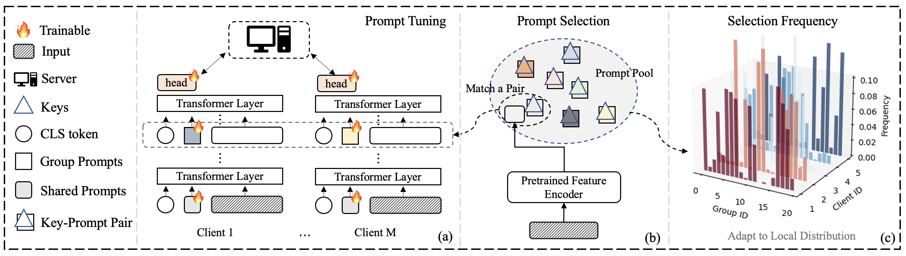

# Unlocking the Potential of Prompt-Tuning in Bridging Generalized and Personalized Federated Learning.
This is the official implementation of paper [Unlocking the Potential of Prompt-Tuning in Bridging Generalized and Personalized Federated Learning](https://arxiv.org/abs/2310.18285).

Vision Transformers (ViT) and Visual Prompt Tuning (VPT) achieve state-of-the-art performance with improved efficiency in various computer vision tasks. This suggests a promising paradigm shift of adapting pre-trained ViT models to Federated Learning (FL) settings. However, the challenge of data heterogeneity among FL clients presents a significant hurdle in effectively deploying ViT models. Existing Generalized FL (GFL) and Personalized FL (PFL) methods have limitations in balancing performance across both global and local data distributions. In this paper, we present a novel algorithm, SGPT, that integrates GFL and PFL approaches by employing a unique combination of both shared and group-specific prompts. This design enables SGPT to capture both common and group-specific features. A key feature of SGPT is its prompt selection module, which facilitates the training of a single global model capable of automatically adapting to diverse local client data distributions without the need for local fine-tuning. To effectively train the prompts, we utilize block coordinate descent (BCD), learning from common feature information (shared prompts), and then more specialized knowledge (group prompts) iteratively. Theoretically, we justify that learning the proposed prompts can reduce the gap between global and local performance. Empirically, we conduct experiments on both label and feature heterogeneity settings in comparison with state-of-the-art baselines, along with extensive ablation studies, to substantiate the superior performance of SGPT.

<br/>


## Requirements

To install requirements:

```setup
python -m venv SGPT
source SGPT/bin/activate
pip install -r requirements.txt
```

```data  and checkpoint
mkdir data
mkdir checkpoints
```
then you need to download the [pretrained imagenet-21k](https://github.com/google-research/vision_transformer) model and rename it to imagenet21k_ViT-B_16.npz into checkpoints folder. You can also download it [here](https://drive.google.com/file/d/17CUMf4m8mNAvT8iyhytIVM0WXy1dINUE/view?usp=sharing).
## Datasets

We provide two federated benchmark datasets spanning image classification task CIFAR100 and officenet for label heterogentiy and feature heterogentiy respectively.

### CIFAR100
For CIFAR100 dataset, download and unzip data under 'data' file catalog or simply run corresponding algorithm and our program will download data automatically.

### office-caltech10
Please download our pre-processed datasets [here](https://mycuhk-my.sharepoint.com/:u:/g/personal/1155149226_link_cuhk_edu_hk/EaBgx5UmvatMi0KdvfdLWsABC49vcjZ2n9oZkjwl8jPMyA?e=TDxqN5), put under data/ directory and perform following commands:
```
cd ./data
unzip office_caltech_10_dataset.zip
```

## Usage
Here is one example to run our  SGPT, we provide the parameter used to train each task in the tran.sh, select the corresponding task and command other tasks and run the following comman
```
sh train.sh
```


Our [paper]([https://ieeexplore.ieee.org/abstract/document/9197069](https://arxiv.org/abs/2310.18285)) appears at CVPR 2024. If you use, compare with, or refer to this work, please cite

```bibtex
@article{deng2023unlocking,
  title={Unlocking the Potential of Prompt-Tuning in Bridging Generalized and Personalized Federated Learning},
  author={Deng, Wenlong and Thrampoulidis, Christos and Li, Xiaoxiao},
  journal={CVPR},
  pages={},
  year={2024}
}
```

## Contact
Please submit a Github issue or contact dwenlong@ece.ubc.ca if you have any questions or find any bugs.
